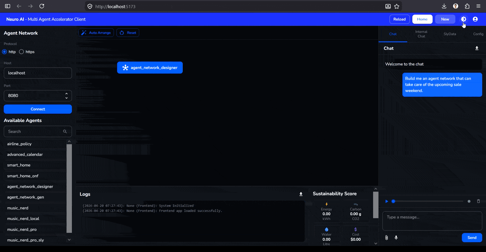

# 🧠 Neuro AI — Multi-Agent Accelerator Client

> A modern, responsive frontend for [NeuroSan](https://github.com/cognizant-ai-labs/neuro-san) — making it easy to design, connect, and orchestrate multi-agent AI networks through a clean, intuitive UI.


---

## 🎯 Purpose

NeuroSan is a powerful multi-agent AI orchestration backend — but navigating it through a terminal or a bare-bones interface creates unnecessary friction. This project builds a **user-friendly, modern client UI** so developers and non-developers alike can:

- Browse and select available agents visually
- Configure network connections without touching config files
- Chat with agent networks in real time
- Monitor sustainability metrics (energy, carbon, water, cost) at a glance
- Switch between dark and light mode for comfortable long sessions

The goal is to make NeuroSan feel as approachable as a modern SaaS product — without sacrificing any of its power.

---

## 📸 Before & After

### Before — Original NeuroSan UI

The starting point: a functional but developer-facing interface.


---

### After — Figma Design (Base Reference)

A full UI redesign was created in Figma first, establishing the layout, color system, component structure, and interaction patterns before a single line of code was written.


---

### Final Build

The finished implementation — pixel-close to the Figma spec, fully functional in the browser.

**Light Mode**


**Dark Mode**


---

## ✨ Features in Action

### 🌗 Dark & Light Mode

Seamless theme switching with a single click — all colors, backgrounds, and borders adapt instantly.



---

### ✅ Agent Selection

Click any agent to select or deselect it. Selected agents are highlighted in `#0051FF` with clear visual feedback. Multiple agents can be active simultaneously.


---

### 🔍 Agent Search

Filter the agent list in real time by typing in the search box — useful when the network grows large.


---

## 🛠️ Development Process

### 1. Design in Figma
The UI was fully designed in Figma before development began. This ensured a clear visual spec — layout grids, color tokens, typography scale, component states — so implementation decisions were made upfront, not during coding.

### 2. AI-Assisted Development
The implementation used a combination of **GitHub Copilot** (for in-editor autocomplete and boilerplate) and **Claude** (for component architecture, MUI theming, and iterative debugging). This hybrid workflow dramatically accelerated development while keeping the codebase clean and intentional.

### 3. TypeScript Throughout
The entire codebase is written in **TypeScript**. Component props are typed, state shapes are explicit, and there are no implicit `any` values — making the code easier to refactor and safe to extend.

### 4. Design Tokens — No Magic Numbers
Rather than scattering hardcoded values across the codebase, all visual constants live in a single `TOKENS` object at the top of `App.tsx`:

```ts
const TOKENS = {
  colorPrimary:    "#0051FF",
  colorHeaderBg:   "#1A2BE0",
  borderWidth:     "1px",
  fontSizeXs:      11,
  fontSizeSm:      12,
  fontSizeMd:      13,
  fontSizeLg:      14,
  fontSizeTitle:   15,
  radiusSm:        "6px",
  radiusMd:        "8px",
};
```

Changing the primary color or font scale across the entire app is a one-line edit.

### 5. Local Testing
The app was tested locally using **Vite's dev server** against a running NeuroSan backend, verifying agent listing, connection flow, chat, and theme switching across both light and dark modes.

### 6. Published to GitHub
Once stable, the project was pushed to GitHub at [isaacphilip7/Neuro-UI-Sky-Blue](https://github.com/isaacphilip7/Neuro-UI-Sky-Blue) for open collaboration and future iteration.

---

## 🚀 Running Locally

Follow these steps to get the app running on your machine.

### Prerequisites

Make sure you have the following installed:

- [Node.js](https://nodejs.org/) — v18 or higher
- [npm](https://www.npmjs.com/) — comes with Node.js
- A running [NeuroSan](https://github.com/cognizant-ai-labs/neuro-san) backend (for full functionality)

---

### Step 1 — Clone the Repository

```bash
git clone https://github.com/isaacphilip7/Neuro-UI-Sky-Blue.git
cd Neuro-UI-Sky-Blue
```

---

### Step 2 — Install Dependencies

```bash
npm install
```

This installs React, MUI, TypeScript, Vite, and all other dependencies listed in `package.json`.

---

### Step 3 — Start the Dev Server

```bash
npm run dev
```

Open your browser and navigate to:

```
http://localhost:5173
```

You should see the Neuro AI client running.

---

### Step 4 — Connect to NeuroSan

In the sidebar:

1. Select your **Protocol** (`http` or `https`)
2. Enter the **Host** where your NeuroSan server is running (default: `localhost`)
3. Enter the **Port** (default: `8080`)
4. Click **Connect**

The Available Agents list will populate from your backend once connected.

---

### Step 5 — Build for Production (Optional)

```bash
npm run build
```

The optimised output is placed in the `dist/` folder, ready to be served by any static host (Nginx, Vercel, GitHub Pages, etc.).

---

## 📦 Tech Stack

| Technology | Role |
|---|---|
| [React 18](https://react.dev/) | UI framework |
| [TypeScript 5](https://www.typescriptlang.org/) | Type-safe development |
| [Material UI v5](https://mui.com/) | Component library & theming |
| [Vite 5](https://vitejs.dev/) | Dev server & build tool |
| [NeuroSan](https://github.com/cognizant-ai-labs/neuro-san) | Multi-agent AI backend |

---

## 🗂️ Project Structure

```
Neuro-UI-Sky-Blue/
├── assets/                  ← Screenshots and GIFs for README
├── public/
├── src/
│   ├── App.tsx              # Root — layout, theme provider, all panels
│   ├── main.tsx             # Entry point
│   └── Components/
│       ├── header.tsx
│       └── ...
├── README.md
├── package.json
├── tsconfig.app.json
├── tsconfig.json
└── vite.config.ts
```

---

## 🙏 Acknowledgements

- [NeuroSan](https://github.com/cognizant-ai-labs/neuro-san) — the multi-agent orchestration engine this UI is built for
- [Material UI](https://mui.com/) — the component library powering the design system
- [Vite](https://vitejs.dev/) — for an outstanding developer experience
- [Figma](https://figma.com/) — where the design was born
- **GitHub Copilot** & **Claude** — AI pair programmers that made this faster and better

---

## 🔧 Inputs for Dev

> The following is the original template documentation generated by Vite when this project was scaffolded. It contains useful references for ESLint configuration and plugin options.

This template provides a minimal setup to get React working in Vite with HMR and some ESLint rules.

Currently, two official plugins are available:

- [@vitejs/plugin-react](https://github.com/vitejs/vite-plugin-react/blob/main/packages/plugin-react) uses [Oxc](https://oxc.rs)
- [@vitejs/plugin-react-swc](https://github.com/vitejs/vite-plugin-react/blob/main/packages/plugin-react-swc) uses [SWC](https://swc.rs/)

### React Compiler

The React Compiler is not enabled on this template because of its impact on dev & build performances. To add it, see [this documentation](https://react.dev/learn/react-compiler/installation).

### Expanding the ESLint Configuration

If you are developing a production application, we recommend updating the configuration to enable type-aware lint rules:

```js
export default defineConfig([
  globalIgnores(['dist']),
  {
    files: ['**/*.{ts,tsx}'],
    extends: [
      // Other configs...

      // Remove tseslint.configs.recommended and replace with this
      tseslint.configs.recommendedTypeChecked,
      // Alternatively, use this for stricter rules
      tseslint.configs.strictTypeChecked,
      // Optionally, add this for stylistic rules
      tseslint.configs.stylisticTypeChecked,

      // Other configs...
    ],
    languageOptions: {
      parserOptions: {
        project: ['./tsconfig.node.json', './tsconfig.app.json'],
        tsconfigRootDir: import.meta.dirname,
      },
      // other options...
    },
  },
])
```

You can also install [eslint-plugin-react-x](https://github.com/Rel1cx/eslint-react/tree/main/packages/plugins/eslint-plugin-react-x) and [eslint-plugin-react-dom](https://github.com/Rel1cx/eslint-react/tree/main/packages/plugins/eslint-plugin-react-dom) for React-specific lint rules:

```js
// eslint.config.js
import reactX from 'eslint-plugin-react-x'
import reactDom from 'eslint-plugin-react-dom'

export default defineConfig([
  globalIgnores(['dist']),
  {
    files: ['**/*.{ts,tsx}'],
    extends: [
      // Other configs...
      // Enable lint rules for React
      reactX.configs['recommended-typescript'],
      // Enable lint rules for React DOM
      reactDom.configs.recommended,
    ],
    languageOptions: {
      parserOptions: {
        project: ['./tsconfig.node.json', './tsconfig.app.json'],
        tsconfigRootDir: import.meta.dirname,
      },
      // other options...
    },
  },
])
```
